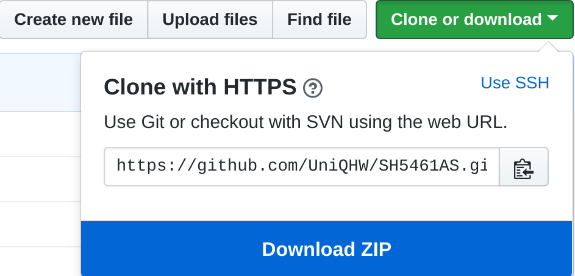
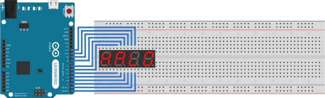

# SH5461AS 4 Digit Segment Display Library

Just another library to communicate with the SHA5461AS 4 Digit Segment Display.

This library has been written in order to help a pupil of mine with his Arduino project.


## Contents

- [Installation](#installation)
- [Importing/Including](#importingincluding)
- [Example](#example)
- [Flags](#flags)
- [Library Overview](#library-overview)
	- [`class Display`](#class-display)
		- [Constructor](#constructor)
		- [Members](#members)
		- [Member Functions](#member-functions)
			- [`void print(const char[])`](#void-printconst-char)
				- [Example](#example)
			- [`void toggle()`](#void-toggle)
			- [`void toggle(bool arg_state)`](#void-togglebool-argstate)
			- [`void fill(bool all = true)`](#void-fillbool-all-true)
			- [`void empty()`](#void-empty)
	- [`class Digit`](#class-digit)
		- [Members](#members)
		- [Member Functions](#member-functions)
			- [`void toggle()`](#void-toggle)
			- [`void toggle(bool arg_state)`](#void-togglebool-argstate)
	- [`class Segment`](#class-segment)
		- [Members](#members)
		- [Member Functions](#member-functions)
			- [`void toggle()`](#void-toggle)
			- [`void toggle(bool arg_state)`](#void-togglebool-argstate)
- [License](#license)

## Installation

Download the repository as a zip



After obtaining a local copy of the library, import the library in the [Arduino IDE](https://create.arduino.cc/):


## Importing/Including

Add the following to the top of your source file in order to include this library:
```cpp
#include "Segment.h"
#include "Digit.h"
#include "Display.h"
```

## Example

The following example prints `1.234` to the display
```cpp
#include <Arduino.h>

/* Include this library */
#include "Segment.h"
#include "Digit.h"
#include "Display.h"

const byte digit_pins[4] {6, 9, 10, 0}; // From com1 - com4
const byte segment_pins[7] {7, 11, 2, 4, 5, 8, 1}; // From a - g (abc...g)
const byte dp_pin = 3;

Display *d;

void setup() {
  for (int i = 0; i <= A5; i++) {
    pinMode(i, OUTPUT);
  }

  d = new Display(digit_pins, segment_pins, dp_pin);
}

void loop() {
  d->print("1.234"); // Must be looped!
}
```

Setup used for example:



Result:


## Flags

The following preprocessor directives may be used to optimize the library:

|Preprocessor |Description          |
|-------------|---------------------|
|#DISABLE_DP|Disables support for decimal points, minimally increasing frame rate|
|#USED_DIGITS N|Limits display to only use first N digits|


Preprocessors must be set **BEFORE** the library is included:

```cpp
#define DISABLE_DP
#define USED_DIGITS 3

#include "Segment.h"
#include "Digit.h"
#include "Display.h"
```

Turning off specific digits disregarding the position, can be done using the `\0` character (See `print` in [`class Dispaly`](#class-display))

## Library Overview

The library provides a total of three classes:

|Class|Defined In|Description|
|-----|----------|-----------|
|Display|[Display.h](https://github.com/UniQHW/SH5461AS/blob/master/Digit.h#L30)|Display controller class|  
|Digit|[Digit.h](Digit.h)|Hardware abstraction for COM pins|
|Segment|[Segment.h](Segment.h)|Hardware abstraction for segments|

The Display class acts as a display controller and should be sufficient for most applications. It comes with a `print` function that displays the provided number string on the display. See [`class Display`](#class-display) for more.

### `class Display`
A display controller class

#### Constructor
The constructor is provided with the necessary pin information in order to successfully communicate with the display.

```cpp
#ifdef DISABLE_DP
  Display(byte digit_pins[USED_DIGITS], byte segment_pins[7])
#else
  Display(byte digit_pins[USED_DIGITS], byte segment_pins[7], byte dp_pin)
#endif
```

|Parameter|Description|Example|
|---------|-----------|-------|
|byte digit_pins[USED_DIGITS]|Array of digit pins `COM1 - COM4`|`byte digit_pins[4] {A1, A2, A3, A4};`|
|byte segment_pins[7]|Array of segment pins `a - g (abc..g)`|`byte segment_pins[7] {A5, 12, 11, 0, A4, A0, 10};`|
|byte dp_pin|Pin to control Decimal Point. Leave out if `#DISABLE_DP` has been defined|`1`|


#### Members

|Member|Access|Description|
|------|------|-----------|
|bool state|Private|A private state buffer for `toggle()`|
|Digit *digits[USED_DIGITS]|Public|Stores [digit objects](#digit) to activate/disable COMs|
|Segment *segments[7]|Public|Stores [segment objects](#segment) from `a - g (abc...g)` to activate and disable segments|
|DecimalPoint *d|Public|Stores dp object (alias to [segment objects](#segment)) to activate/disable dp|

#### Member Functions

##### `void print(const char[])`
> Access: Public

Prints a string of numbers onto display. The string may only include characters `\0`, `0-9` and `.` (unless `#DISABLE_DP` has been defined). **The print function requires to be constantly refreshed!**

If `\0` has been provided, no number is displayed (Ex: `print("1\0\01")` will display 1 on the first and last digit only).

Because speed is crucial, this function provides no error-checking. As a result, if too many, or invalid characters have been specified, the display will return unpredictable/wrong results.

###### Example
```cpp
void loop() {
  d->print("1.234")
}
```


##### `void toggle()`
> Access: Public

Toggles **all** digits on or off, depending on it's previous state.

|Display prior toggle|Display after toggle|
|--------------------|--------------------|
|OFF|ON|
|ON|OFF|

##### `void toggle(bool arg_state)`
> Access: Public

Sets **all** digits to the provided state.

|State|Display after toggle|
|-----|--------------------|
|true|ON|
|false|OFF|

##### `void fill(bool all = true)`
> Access: Public

Turns all segments and decimal points to '**ON**' (unless `#DISABLE_DP` has been defined). If `bool all` has been set to `false`, only digits that are '**ON**' will be filled.


##### `void empty()`
> Access: Public

Turns all segments and decimal points to '**OFF**'.

### `class Digit`
A hardware abstraction for COM pins

The constructor is provided with the necessary pin information in order to successfully communicate with the display.

```cpp
Digit(byte pin);
```

|Parameter|Description|Example|
|---------|-----------|-------|
|byte pin|COM pin|`A1`|

#### Members

|Member|Access|Description|
|------|------|-----------|
|byte pin|Private|COM pin|
|bool state|Private|A private state buffer for `toggle()`|

#### Member Functions

##### `void toggle()`
> Access: Public

Toggles digit on or off, depending on it's previous state.

|Digit prior toggle|Digit after toggle|
|------------------|------------------|
|OFF|ON|
|ON|OFF|

##### `void toggle(bool arg_state)`
> Access: Public

Sets digit to the provided state.

|State|Digit after toggle|
|-----|------------------|
|true|ON|
|false|OFF|

### `class Segment`
A hardware abstraction for segments

The constructor is provided with the necessary pin information in order to successfully communicate with the display.

```cpp
Segment(byte pin);
```

|Parameter|Description|Example|
|---------|-----------|-------|
|byte pin|Segment pin|`A0`|


#### Members

|Member|Access|Description|
|------|------|-----------|
|byte pin|Private|Segment pin|
|bool state|Private|A private state buffer for `toggle()`|

#### Member Functions

##### `void toggle()`
> Access: Public

Toggles segment on or off, depending on it's previous state.

|Segment prior toggle|Segment after toggle|
|--------------------|--------------------|
|OFF|ON|
|ON|OFF|

##### `void toggle(bool arg_state)`
> Access: Public

Sets segment to the provided state.

|State|Segment after toggle|
|-----|--------------------|
|true|ON|
|false|OFF|

## License

```
The MIT License (MIT)

Copyright (c) 2018 Patrick Pedersen

Permission is hereby granted, free of charge, to any person obtaining a copy
of this software and associated documentation files (the "Software"), to deal
in the Software without restriction, including without limitation the rights
to use, copy, modify, merge, publish, distribute, sublicense, and/or sell
copies of the Software, and to permit persons to whom the Software is
furnished to do so, subject to the following conditions:

The above copyright notice and this permission notice shall be included in
all copies or substantial portions of the Software.

THE SOFTWARE IS PROVIDED "AS IS", WITHOUT WARRANTY OF ANY KIND, EXPRESS OR
IMPLIED, INCLUDING BUT NOT LIMITED TO THE WARRANTIES OF MERCHANTABILITY,
FITNESS FOR A PARTICULAR PURPOSE AND NONINFRINGEMENT. IN NO EVENT SHALL THE
AUTHORS OR COPYRIGHT HOLDERS BE LIABLE FOR ANY CLAIM, DAMAGES OR OTHER
LIABILITY, WHETHER IN AN ACTION OF CONTRACT, TORT OR OTHERWISE, ARISING FROM,
OUT OF OR IN CONNECTION WITH THE SOFTWARE OR THE USE OR OTHER DEALINGS IN
THE SOFTWARE.
```
